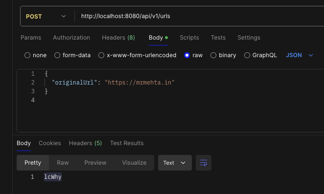
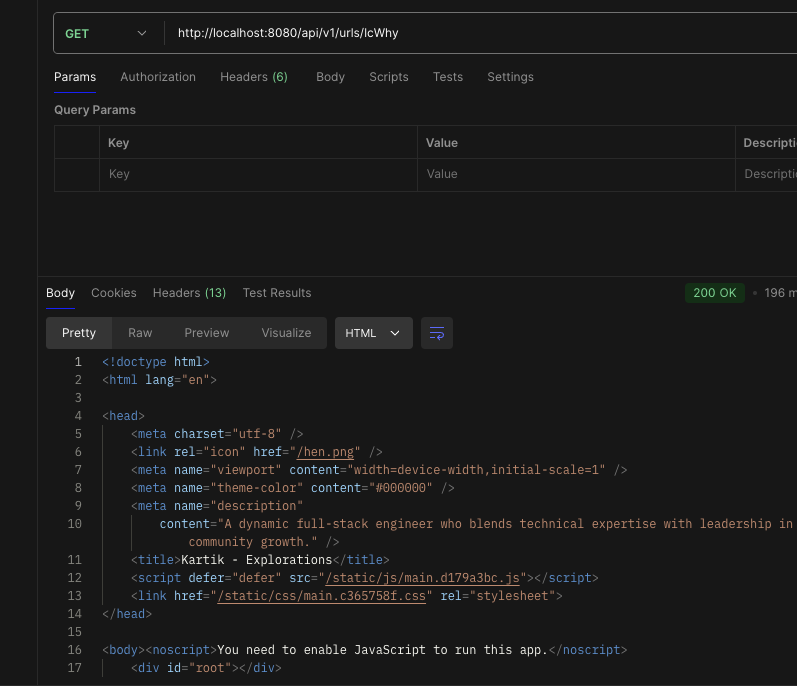

# URL Shortener Project

This project is a simple URL shortener built using Java Spring Boot. It shortens long URLs into shorter versions and allows you to redirect to the original URL using the shortened link.

## Table of Contents

- [Getting Started](#getting-started)
- [Project Structure](#project-structure)
- [Endpoints](#endpoints)
- [Detailed Explanation](#detailed-explanation)
- [Dependencies](#dependencies)

## Getting Started

To run this project, you need to have Java 22 and Gradle installed on your machine.

### Running the Application

1. Clone the repository to your local machine.
2. Navigate to the project directory.
3. Run the following command to build and start the application:

   ```sh
   ./gradlew bootRun
   ```

4. The application will start on `http://localhost:8080`.

## Project Structure

The project follows the typical structure of a Spring Boot application:

```
shortner/
├── src/
│   ├── main/
│   │   ├── java/
│   │   │   └── com/
│   │   │       └── url/
│   │   │           └── shortner/
│   │   │               ├── controller/
│   │   │               │   └── UrlShortenerController.java
│   │   │               ├── model/
│   │   │               │   ├── UrlEntity.java
│   │   │               │   └── UrlRequest.java
│   │   │               ├── repository/
│   │   │               │   └── UrlRepository.java
│   │   │               ├── service/
│   │   │               │   ├── UrlShortenerService.java
│   │   │               │   └── UrlShortenerServiceImpl.java
│   │   │               ├── util/
│   │   │               │   ├── UrlValidatorUtil.java
│   │   │               │   └── Base62Encoder.java
│   │   │               ├── exception/
│   │   │               │   └── UrlNotFoundException.java
│   │   │               └── ShortnerApplication.java
│   │   └── resources/
│   │       └── application.properties
│   └── test/
│       └── java/
│           └── com/
│               └── url/
│                   └── shortner/
│                       └── UrlShortenerControllerTest.java
└── build.gradle
```

## Endpoints

### 1. Create Short URL



- **Endpoint:** `POST /api/v1/urls`
- **Description:** Creates a shortened version of a provided URL.
- **Request Body:**

  ```json
  {
    "originalUrl": "https://mrmehta.in"
  }
  ```

- **Response:**

  ```json
  {
    "shortUrl": "abc123"
  }
  ```

### 2. Redirect to Original URL



- **Endpoint:** `GET /api/v1/urls/{shortUrl}`
- **Description:** Redirects to the original URL corresponding to the provided short URL.
- **Example URL:** `GET /api/v1/urls/abc123`

## Detailed Explanation

### `ShortnerApplication.java`

This is the main entry point of your Spring Boot application.

### `UrlEntity.java`

This class represents the data model for the URLs that will be stored in the database.

### `UrlShortenerService.java`

This is the service interface that defines the methods related to URL shortening.

### `UrlShortenerServiceImpl.java`

This is the implementation of the `UrlShortenerService` interface.

### `UrlRepository.java`

This is the repository interface for interacting with the database.

### `UrlShortenerController.java`

This is the controller that handles HTTP requests.

### `UrlRequest.java`

This class encapsulates the request data for creating a short URL.

### `Base62Encoder.java`

This utility class handles encoding of integers to a Base62 string.

### `UrlValidatorUtil.java`

This utility class handles the validation of URLs.

## Dependencies

- Spring Boot 3.x
- Java 22
- Hibernate ORM
- H2 Database
- Jakarta Persistence API
- Jakarta Validation API
